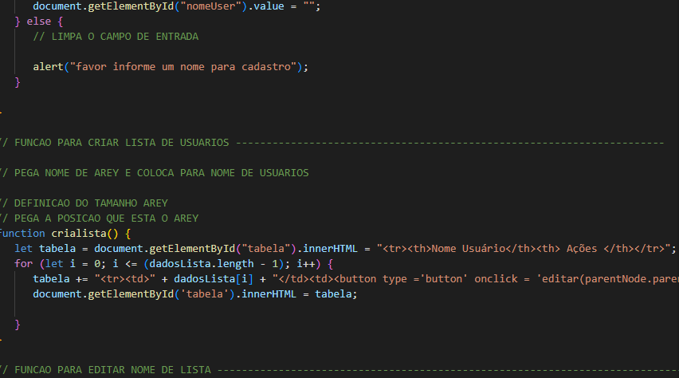
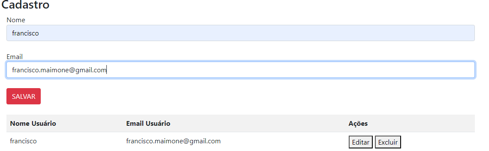
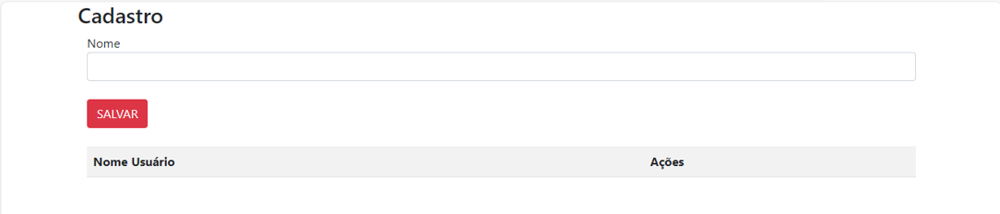

# CADASTRO LOGIN E HTML FUNCAO.

>* `` Insere uma caixa de texto com funcoes de salvar para nomes adicionados na parte de colocar a mensagem, com opcoes de editar e excluir os dados adicionado na caixa de mensagem e tambem montando a estrutura do projeto``

#  🛠 OQUE O JAVA APRESENTA 🛠

>* ``Ele faz o cadastro de usuários e aprova o registro feito.``

#  ⚒ FUNCIONALIDADES DO JAVA ⚒

 >* `` A funcao acessar, verifica se os campo de nome foram preenchidos no formulário de login, validando a informacao.``

 >* `` A funcao acessar, verifica se os campo de email foram preenchidos no formulário de login, validando a informacao.``

>* ``A função salvarUser adiciona um nome na lista de usuários atualizando a tabela na página de cadastro e dando opcao de arrumar o campo de mensagem.``

>* ``A função editar(i) atualiza o campo de entrada com o nome selecionado para edição.``

>* ``A função excluir(i) remove o nome selecionado da lista e atualiza a tabela.``

>* `` com partes que o array pega as posicao da function criar tabela, evitando possiveis lups infinitos. `` 

# 🔧TECNOLOGIAS🔧

>* JavaScript
>* html
>* function
>* vscode
>* alert
>* array
>* value
>* else
>* let
>* if

FRANCISCO

LINK DA PAGINA  https://francisco043.github.io/Login-Cad/

